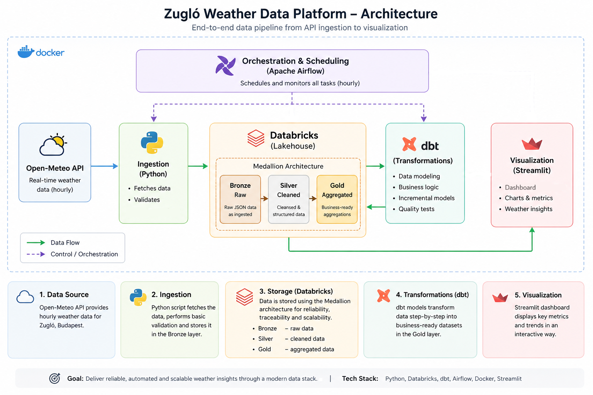

<link>http://178.104.51.77:8501/</link>

### Zugló Weather Data Platform

A production-style data platform for collecting, transforming, and visualizing real-time weather data — built with modern data engineering tools.

---

#### Project Overview

This project ingests hourly weather data from the Open-Meteo API and processes it through a medallion architecture (Bronze → Silver → Gold) using:

- Python for ingestion
- Databricks (Lakehouse) for storage
- dbt for transformations
- Apache Airflow for orchestration
- Streamlit for visualization

The goal is to demonstrate how a real-world data pipeline can be designed end-to-end — from raw ingestion to business-ready insights.

#### Architecture

  

##### Flow:

1. Ingestion (Python)
  - Fetches hourly data from Open-Meteo API
2. Stores raw JSON (Bronze layer)
  - Storage (Databricks Lakehouse)
  - Bronze → raw structured data (Pending)
  - Silver → cleaned, flattened data
  - Gold → aggregated metrics (Pending)
3. Transformation (dbt)
  - Data cleaning
  - Business logic
  - Aggregations (daily stats, trends)
4.Orchestration (Airflow)
  - Scheduled hourly pipeline
  - Retry logic
  - Dependency handling
5. Visualization (Streamlit)
  - Dashboard
  - Weather metrics and trends

### Future Improvements
- Long-term climate tracking
- Yearly comparison
- Weather categorization

### Try it
<link>http://178.104.51.77:8501/</link>

